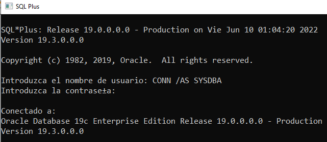
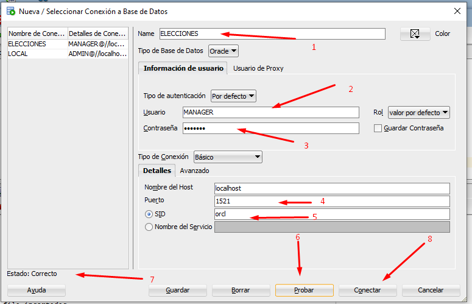

# Bases2_Proyecto1
Proyecto 1 de Sistema de bases 2, vacaciones junio 2022


# ***Instalación de Oracle*** #

Pasos para la instlacion de oracle


+ "Paso 1"

<p align=center>
	 
</p>

+ "Paso 2"

<p align=center>
	 
</p>

+ "Paso 3"

<p align=center>
	 
</p>

+ "Paso 4"

<p align=center>
	 
</p>

+ "Paso 5"

<p align=center>
	 
</p>

+ "Paso 6"

<p align=center>
	 
</p>


# ***Comandos de configuración*** #

Los siguientes comando se ejecutan en SQL Plus:

+ Comando para conectarnos como SYSDBA

> CONN /AS SYSDBA

para la contraseña solo presionamos enter

<p align=center>
	 
</p>


+ Cambio de sesión

> ALTER SESSION SET "_ORACLE_SCRIPT"=TRUE;

+ Creación del TableSpace

> CREATE TABLESPACE ELECCIONESTBS
> DATAFILE 'C:/db/ELECCIONESDTF.tbs' 
> SIZE 250M 
> AUTOEXTEND ON next 10 M
> MAXSIZE 500M;

+ Creaación de usuario manager con default tablespace y asignación de rol DBA

> CREATE USER MANAGER IDENTIFIED BY manager DEFAULT TABLESPACE ELECCIONESTBS TEMPORARY TABLESPACE TEMP;

> GRANT DBA TO MANAGER;

# ***Conexión con SQL DEVELOPER*** #

+ Paso 1

<p align=center>
	 
</p>

+ Paso 2

<p align=center>
	 
</p>

# ***Creación de tablas*** #

+ Tabla de departamentos

```
CREATE TABLE DEPARTAMENTO (
	CODIGO_DEPTO int PRIMARY KEY
	,NOMBRE_DEPTO VARCHAR2(50)
);
```


+ Tabla de municipios

```
CREATE TABLE MUNICIPIO (
	CODIGO_MUNI INT PRIMARY KEY
	,DEPTO_MUNI INT
	,NOMBRE_MUNI VARCHAR2(100)
	,CONSTRAINT FK_DEPARTAMENTO
    FOREIGN KEY (DEPTO_MUNI)
    REFERENCES DEPARTAMENTO(CODIGO_DEPTO)
);
```
