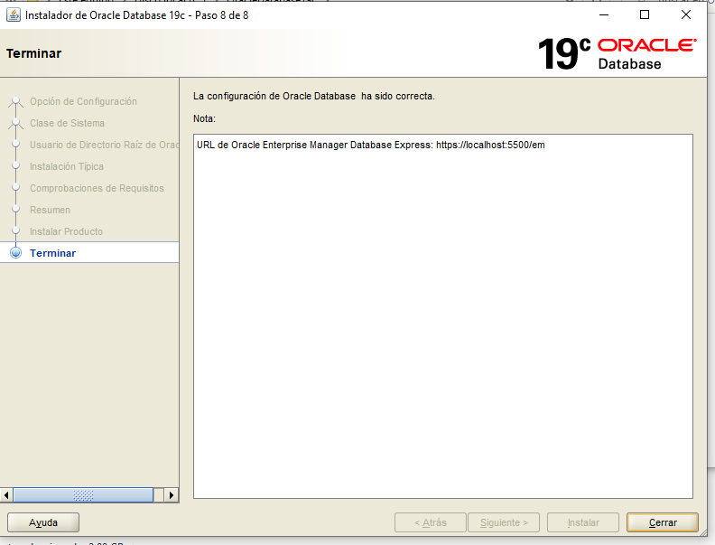
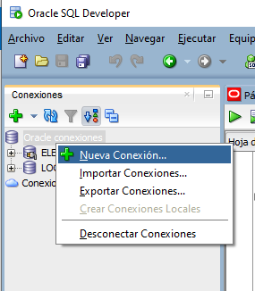

# Bases2_Proyecto1
Proyecto 1 de Sistema de bases 2, vacaciones junio 2022


# ***Instalación de Oracle*** #

Pasos para la instlacion de oracle


+ Paso 1

<p align=center>
	 
</p>


+ Paso 2

<p align=center>
	 
</p>

+ Paso 3

<p align=center>
	 
</p>

+ Paso 4

<p align=center>
	 
</p>

+ Paso 5

<p align=center>
	 
</p>

+ Paso 6

<p align=center>
	 
</p>


# ***Comandos de configuración*** #

Los siguientes comando se ejecutan en SQL Plus:

+ Comando para conectarnos como SYSDBA

> CONN /AS SYSDBA

para la contraseña solo presionamos enter

<p align=center>
	 
</p>


+ Cambio de sesión

> ALTER SESSION SET "_ORACLE_SCRIPT"=TRUE;

+ Creación del TableSpace

```
CREATE TABLESPACE ELECCIONESTBS
DATAFILE 'C:/db/ELECCIONESDTF.tbs' 
SIZE 250M 
AUTOEXTEND ON next 10 M
MAXSIZE 500M;
```

+ Creaación de usuario manager con default tablespace y asignación de rol DBA

> CREATE USER MANAGER IDENTIFIED BY manager DEFAULT TABLESPACE ELECCIONESTBS TEMPORARY TABLESPACE TEMP;

> GRANT DBA TO MANAGER;

# ***Conexión con SQL DEVELOPER*** #

+ Paso 1

<p align=center>
	 
</p>

+ Paso 2

<p align=center>
	 
</p>

# ***Creación de tablas e inserción de datos*** #

Para la creación de tablas se ejecutó el archivo:
+ Script Autenticacion

Para la inserción de datos se ejecutó el archivo:
+ Example data

# ***Creación de usuarios y asignación de permisos*** #

+ Creación de usuarios

```
CREATE USER guest1 IDENTIFIED BY guest1 DEFAULT TABLESPACE ELECCIONESTBS TEMPORARY TABLESPACE TEMP;
CREATE USER guest2 IDENTIFIED BY guest2 DEFAULT TABLESPACE ELECCIONESTBS TEMPORARY TABLESPACE TEMP;
CREATE USER guest3 IDENTIFIED BY guest3 DEFAULT TABLESPACE ELECCIONESTBS TEMPORARY TABLESPACE TEMP;

CREATE USER mesas1 IDENTIFIED BY mesas1 DEFAULT TABLESPACE ELECCIONESTBS TEMPORARY TABLESPACE TEMP;
CREATE USER mesas2 IDENTIFIED BY mesas2 DEFAULT TABLESPACE ELECCIONESTBS TEMPORARY TABLESPACE TEMP;
CREATE USER mesas3 IDENTIFIED BY mesas3 DEFAULT TABLESPACE ELECCIONESTBS TEMPORARY TABLESPACE TEMP;
CREATE USER mesas4 IDENTIFIED BY mesas4 DEFAULT TABLESPACE ELECCIONESTBS TEMPORARY TABLESPACE TEMP;

CREATE USER it1 IDENTIFIED BY it1 DEFAULT TABLESPACE ELECCIONESTBS TEMPORARY TABLESPACE TEMP;
CREATE USER it2 IDENTIFIED BY it2 DEFAULT TABLESPACE ELECCIONESTBS TEMPORARY TABLESPACE TEMP;
CREATE USER it3 IDENTIFIED BY it3 DEFAULT TABLESPACE ELECCIONESTBS TEMPORARY TABLESPACE TEMP;

CREATE USER admin1 IDENTIFIED BY admin1 DEFAULT TABLESPACE ELECCIONESTBS TEMPORARY TABLESPACE TEMP;
CREATE USER admin2 IDENTIFIED BY admin2 DEFAULT TABLESPACE ELECCIONESTBS TEMPORARY TABLESPACE TEMP;
```

+ Asignación de permisos

```
GRANT CREATE SESSION TO guest1, guest2, guest3, mesas1, mesas2, mesas3, mesas4, it1, it2, it3, admin1, admin2;
GRANT SELECT ANY TABLE TO guest1, guest2, guest3, mesas1, mesas2, mesas3, mesas4, it1, it2, it3, admin1, admin2;
GRANT INSERT ANY TABLE TO mesas1, mesas2, mesas3, mesas4, admin1, admin2;
GRANT UPDATE ANY TABLE TO admin1, admin2;
GRANT DELETE ANY TABLE TO admin1, admin2;
GRANT CREATE USER TO it1, it2, it3, admin1, admin2;
GRANT CREATE TABLE TO it1, it2, it3;
GRANT CREATE VIEW TO guest1;

GRANT DBA TO DB1;
GRANT DBA TO DB2;
```

# ***Creación de vista VOTOSPRESIDENTE*** #

```
CREATE OR REPLACE VIEW VOTOSPRESIDENTE AS
    SELECT NOMBRE_DEPTO AS "Departamento"
        ,NOMBRE_MUNI AS "Municipio"
        ,NOMBRE_PART AS "Partido"
        ,COUNT(*) AS "No. Votos"
    FROM MANAGER.VOTO
    JOIN MANAGER.ACTA ON VOTO_MESA = NUMERO_MESA
        AND VOTO_ELECCION = TIPO_ELECCION
    JOIN MANAGER.PARTIDO ON VOTO_PARTIDO = CODIGO_PART
    JOIN MANAGER.MUNICIPIO ON MANAGER.MUNICIPIO.DEPTO_MUNI = MANAGER.ACTA.DEPARTAMENTO
        AND MANAGER.MUNICIPIO.CODIGO_MUNI = MANAGER.ACTA.MUNICIPIO
    JOIN MANAGER.DEPARTAMENTO ON MANAGER.DEPARTAMENTO.CODIGO_DEPTO = MANAGER.ACTA.DEPARTAMENTO
    WHERE VOTO_ELECCION = 1
    GROUP BY NOMBRE_PART
        ,NOMBRE_MUNI
        ,NOMBRE_DEPTO;
```
# ***Back-Up*** #

+ Creación de tablespace

```
CREATE TABLESPACE LIGATBS
DATAFILE 'C:/db/LIGATBS.tbs' 
SIZE 250M 
AUTOEXTEND ON next 10 M
MAXSIZE 500M;
```

+ Creación de usuarios

```
CREATE USER MANAGERLIGA IDENTIFIED BY manager DEFAULT TABLESPACE LIGATBS TEMPORARY TABLESPACE TEMP;
CREATE USER DB1 IDENTIFIED BY 123 DEFAULT TABLESPACE LIGATBS;
CREATE USER DB2 IDENTIFIED BY 123 DEFAULT TABLESPACE LIGATBS;
```

+ Creación de directorio

```
CREATE OR REPLACE DIRECTORY test_dir AS 'C:/BACKUP/';
```

+ Asignación de permisos a usuario MANAGERLIGA

```
GRANT DBA TO MANAGERLIGA;
GRANT "AQ_USER_ROLE" TO MANAGERLIGA WITH ADMIN OPTION;
ALTER USER MANAGERLIGA DEFAULT ROLE DBA,"AQ_USER_ROLE";
GRANT CREATE USER TO MANAGERLIGA;

CREATE OR REPLACE DIRECTORY test_dir AS 'C:/BACKUP/';
GRANT READ, WRITE ON DIRECTORY test_dir TO MANAGERLIGA;
GRANT DATAPUMP_EXP_FULL_DATABASE TO MANAGERLIGA;
grant create any directory to MANAGERLIGA;
```

+ Asignación de permisos a usuario DB1 y DB2

```
GRANT READ, WRITE ON DIRECTORY test_dir TO DB1;
GRANT DATAPUMP_IMP_FULL_DATABASE TO DB1;
GRANT IMPORT FULL DATABASE TO DB1;

GRANT READ, WRITE ON DIRECTORY test_dir TO DB2;
GRANT DATAPUMP_IMP_FULL_DATABASE TO DB2;
GRANT IMPORT FULL DATABASE TO DB2;

grant create any directory to DB1;
grant create any directory to DB2;
```

+ Export e import de tablas Jugador,Equipo (solo esquemas)

```
expdp MANAGERLIGA/manager tables=Jugador,Equipo directory=test_dir dumpfile=BASE1.dmp logfile=expdpBASE1.log CONTENT=metadata_only
impdp DB1/123 directory=test_dir dumpfile=BASE1.dmp logfile=impdpBASE1.log REMAP_SCHEMA=MANAGERLIGA:DB1
```

+ Export e import de tablas Liga,Jornada

```
expdp MANAGERLIGA/manager tables=Liga,Jornada directory=test_dir dumpfile=BASE2.dmp logfile=expdpBASE2.log
impdp DB2/123 directory=test_dir dumpfile=BASE2.dmp logfile=impdpBASE2.log REMAP_SCHEMA=MANAGERLIGA:DB2
```
